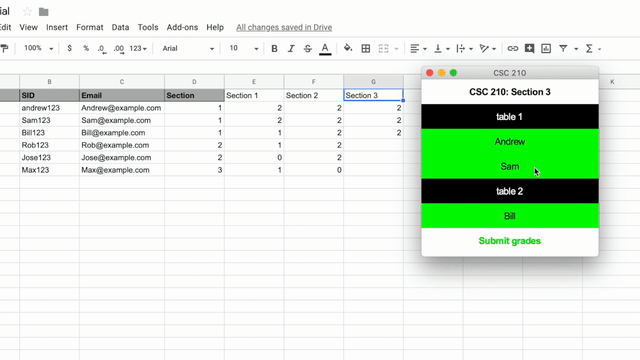

# EasyGrade

Andrew Raftovich, Fall 2019

## About

This program was created to simplify attendance taking through a Google Sheets document by instead of
inserting scores manually into the Sheet, this program provides a GUI (Graphical User Interface) to 
allow users to easily insert/modify scores for students in their section from the full list of students in the class.


The file contains some information before the section scores which will not be affected by the program.

Section scores are in a range from 0 (no points) to 2 (full points).

## Usage



The different colors are used to represent attendance in a simplified way; 
GREEN - 2 points, ORANGE - 1 point, RED- 0 points, & GREY - no points.

1. To get the program to work, the owner of the Google Sheets document must supply users with the 
   Google Drive API credentials JSON file which must be inserted into the same file as the other
   Python classes.

2. Run the start up file to get your students and tables setup.
```Python
Python3 startup.py
```

3. The program is now setup.  Run the run.py file
```Python
Python3 run.py
```

## Dependencies

	Python & Tkinter
